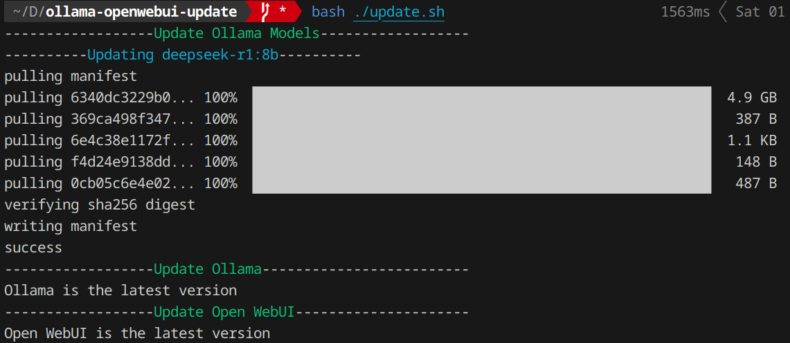

# ollama-openwebui-update

Bash script to easily update Ollama models, Ollama, and Open WebUI (Installed via Docker) in Linux

## What does the script do?
1. Updates all downloaded Ollama models
2. Updates Ollama via the official script if it finds a new release in the GitHub repo
3. Updates Open WebUI via Docker if the local image digest doesn't match the latest image digest in ghcr.io

## How to use?
1. git clone https://github.com/Infiniti151/ollama-openwebui-update.git && cd ollama-openwebui-update
2. chmod +x update.sh
3. ./update.sh

## Output

